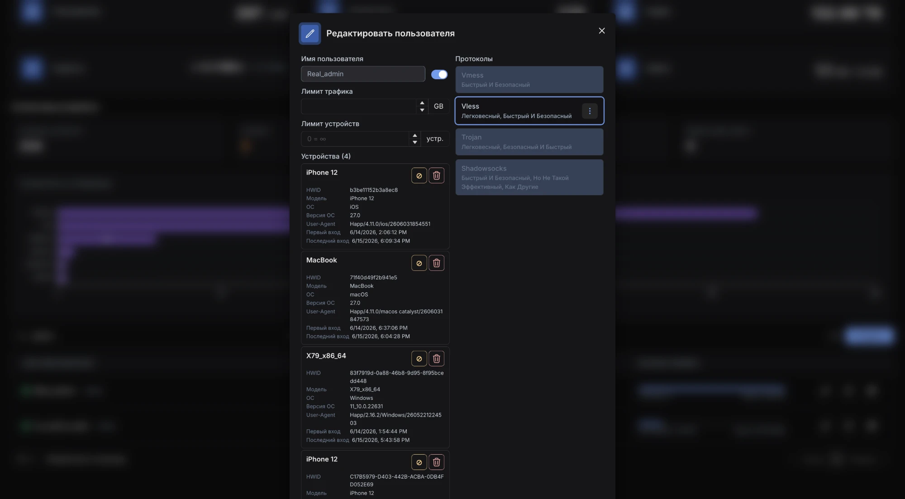
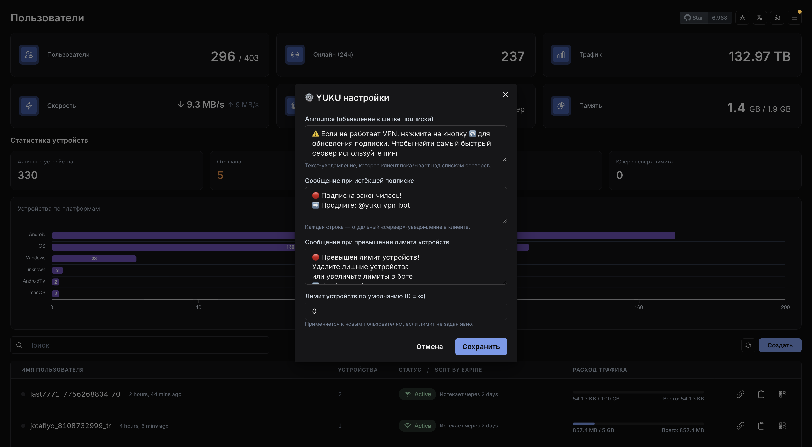

# Marzban yuku-patches

Форк [Gozargah/Marzban](https://github.com/Gozargah/Marzban) `v0.8.4` с патчами для коммерческого
VPN-сервиса. База ветки — тег `v0.8.4` (оригиналы из развёрнутого образа
`gozargah/marzban:latest` байт-в-байт совпадают с тегом).

**Готовый образ:** `ghcr.io/bourbon24k/marzban:0.8.4-yuku-3` (и `:latest`).

## Содержание

1. [CDN/proxy XHTTP GET-uplink](#патч-1--cdnproxy-xhttp-get-uplink)
2. [Стабильность нод](#патч-2--стабильность-нод)
3. [Уведомления клиенту (истёк / лимит)](#патч-3--уведомления-клиенту)
4. [Лимит устройств по HWID + отзыв](#патч-4--лимит-устройств-по-hwid--отзыв)
5. [Лимит трафика по группам хостов](#патч-5--лимит-трафика-по-группам-хостов)
6. [Дашборд: статистика и устройства](#патч-6--дашборд-статистика-и-устройства)
7. [YUKU настройки + надёжность](#патч-7--yuku-настройки--надёжность)

### Карта файлов

| Файл | Назначение |
|------|-----------|
| `app/subscription/v2ray.py` | XHTTP GET-uplink поля в подписке |
| `app/subscription/share.py` | уведомления, метки группового лимита, контекст групп |
| `app/routers/subscription.py` | announce + захват HWID + enforcement лимита устройств |
| `app/xray/node.py` | таймауты и `started` (стабильность нод) |
| `app/xray/config.py` | чтение XHTTP-полей из `xray_config.json` |
| `app/xray/__init__.py` | `id` хоста в dict (нужно для маппинга групп) |
| `app/db/models.py` | device_limit, user_devices(+status), host_groups, user_group_usage |
| `app/db/crud.py` | устройства, группы, членство, переопределения лимитов |
| `app/db/base.py` | SQLite WAL + busy_timeout |
| `app/models/user.py`, `app/models/system.py`, `app/models/host_group.py` | Pydantic-схемы |
| `app/routers/user.py`, `app/routers/host_group.py`, `app/routers/system.py` | API |
| `app/jobs/record_usages.py`, `app/jobs/reset_group_usage.py` | учёт и сброс группового трафика |
| `app/utils/concurrency.py` | пул потоков для xray-операций |
| `app/db/migrations/.../yuku000{1..6}_*.py` | миграции БД (аддитивные) |
| `app/dashboard/...` | статистика, устройства, группы, тема, YUKU настройки |

---

## Патч 1 — CDN/proxy XHTTP GET-uplink

### Проблема
CDN/proxy — кэширующий L7-прокси. Он режет `POST`-uplink (`405`), а mainline-XHTTP шлёт uplink
через POST. Решение — `uplinkHTTPMethod: GET`
([XTLS/Xray-core#5414](https://github.com/XTLS/Xray-core/pull/5414), влит в mainline 31.01.2026).
Чтобы это работало, поля XHTTP должны читаться Marzban из `xray_config.json` и попадать в подписку
(VLESS-URL + v2ray-json). Stock Marzban v0.8.4 этих полей не знает и теряет их.

### Что добавлено
**`app/xray/config.py`** — в секции xhttp/splithttp читаются новые поля:
```python
settings["uplinkHTTPMethod"]     = net_settings.get("uplinkHTTPMethod", "")
settings["xPaddingKey"]          = net_settings.get("xPaddingKey", "")
settings["xPaddingMethod"]       = net_settings.get("xPaddingMethod", "")
settings["xPaddingObfsMode"]     = net_settings.get("xPaddingObfsMode", False)
settings["xPaddingPlacement"]    = net_settings.get("xPaddingPlacement", "")
settings["scStreamUpServerSecs"] = net_settings.get("scStreamUpServerSecs", "")
```
**`app/subscription/v2ray.py`** — три бага: `splithttp_config()` не писал новые параметры в config;
`make_stream_setting()` их не передавал; `extra` dict в `vmess`/`vless`/`trojan` содержал только
`uplinkHTTPMethod`. Добавлены все поля, сигнатуры расширены.

> Требуется ядро Xray ≥ 26.x на сервере **и** клиенте.

---

## Патч 2 — стабильность нод

### Проблема
`XRayNode.started` при таймауте бросал `NodeAPIError` вместо `False` — исключение прерывало
`remove_user()` в середине цикла, истёкшие не вычищались со всех нод. Таймауты `/ping`, `/`,
`/connect` были жёстко `3` c — под нагрузкой/свопом ноды массово помечались упавшими → шторм
переподключений.

### Что изменено
```python
@property
def started(self):
    try:
        res = self.make_request("/", timeout=15)   # было timeout=3 БЕЗ try/except
        return res.get('started', False)
    except NodeAPIError:
        return False
```
Таймауты `/ping` и `/connect` подняты `3 → 15` c, `/disconnect` `3 → 10` c.

---

## Патч 3 — уведомления клиенту

### Идея
Stock Marzban истёкшему юзеру отдаёт подписку с реальными (но нерабочими) серверами. Этот патч
вместо мёртвых серверов отдаёт **сервер-уведомление**: имя записи = текст, виден прямо в списке
серверов клиента. Покрыты `expired`, превышение лимита устройств и превышение группового лимита.

### Что добавлено
- Helper `_generate_notice(config_format, lines)` — собирает фейковую подписку из dummy-outbound на
  `127.0.0.1` с именами-сообщениями. Для `v2ray-json` (Happ) — валидный JSON, иначе vless-ссылки.
- Short-circuit в `generate_subscription` для `expired` и при переданных `notice_lines`.
- Тексты уведомлений берутся из БД (YUKU настройки, см. патч 7) с фолбэком на дефолты.

---

## Патч 4 — лимит устройств по HWID + отзыв

### Идея
Marzban/Xray не знают про «устройства»: один UUID работает на неограниченном числе устройств.
Современные клиенты (**Happ**, v2rayTun) шлют `x-hwid` (+ модель/ОС/версия) при запросе подписки.
Панель регистрирует устройства, считает и ограничивает.

### Что добавлено
**БД** (`models.py`, миграции `yuku0001`, `yuku0003`):
- `users.device_limit` (0/NULL = безлимит);
- таблица `user_devices` (hwid, platform, os_version, device_model, user_agent, created_at,
  last_seen, **status**), UNIQUE(user_id, hwid), каскад с юзером;
- `status` (`active`/`revoked`) — отозванные не считаются в лимит, но остаются в истории.

**CRUD** (`crud.py`):
- `register_user_device()` — обрабатывает HWID-клиентов **и** клиентов без HWID
  (псевдо-HWID `unknown-device` по user-agent → закрыт обход через v2rayNG);
- `_touch_device_if_stale()` — дебаунс записи (`DEVICE_TOUCH_DEBOUNCE_SECONDS=600`), чтобы
  повторные обновления подписки не создавали write-storm;
- `revoke_user_device()` — мягкая блокировка; `IntegrityError`-защита от гонок.

**Подписка** (`subscription.py`): `enforce_device_limit()` — регистрирует устройство (с дебаунсом
даже для безлимитных), при превышении отдаёт notice-подписку.

**API** (`user.py`):
- `GET /api/user/{username}/devices` → `{devices, total, device_limit}`
- `DELETE /api/user/{username}/devices/{device_id}`
- `POST /api/user/{username}/devices/{device_id}/revoke`
- лимит — через обычный `PUT /api/user/{username}` (`device_limit`).

### Ограничения
- Полноценно работает с клиентами, шлющими `x-hwid` (**Happ**). Без HWID — учёт по user-agent.
- По умолчанию `device_limit=0` — существующие юзеры без ограничений.



---

## Патч 5 — лимит трафика по группам хостов

### Идея
Отдельный лимит трафика на **именованную группу** нод/хостов (напр. «play2go»), независимо от
общего лимита юзера. Остаток показывается прямо в названии сервера и обновляется; при превышении
сервер заменяется заглушкой. Только явно добавленные в группу юзеры (membership) видят кап и
энфорсятся.

### Что добавлено
**БД** (`models.py`, миграции `yuku0004`–`yuku0006`):
- `host_groups` (name, traffic_limit, reset_strategy, notice_text, **include_master**);
- M2M `host_group_hosts` / `host_group_nodes` (node UNIQUE — нода метрится в одну группу);
- `user_group_usage` (used_traffic, **traffic_limit** per-user override, **member**, reset_at).

**Учёт** (`jobs/record_usages.py`): `record_group_usages()` маппит `node_id → group_id` и апсертит
трафик. Xray даёт только per-node статистику; `include_master=True` привязывает трафик мастера
(`node_id=None`) к группе. Сброс — `jobs/reset_group_usage.py` (почасовой, по reset_strategy).

**Подписка** (`share.py`): `build_group_context(user)` собирает per-user состояние групп (только для
member); `process_inbounds_and_tags` инжектит `{GROUP_USED}`/`{GROUP_LIMIT}`/`{GROUP_REMAINING}` (в
ГБ), авто-дописывает ` (X.X/Y.Y ГБ)` к названию хоста, при превышении — одна заглушка на группу.

**API** (`host_group.py`):
- CRUD групп: `GET/POST/PUT/DELETE /api/host-group[/{id}]`, `GET /api/host-candidates`;
- per-user: `GET /api/user/{u}/group-usage`, `PUT /api/user/{u}/group/{gid}`
  (`{member?, traffic_limit?, set_limit}`), `POST /api/user/{u}/group/{gid}/reset`;
- 409 при конфликте ноды/мастера/имени.

**Дашборд**: модалка управления группами (`HostGroupsModal`), в карточке юзера — чекбокс «В группе»
+ переопределение лимита.

> Задание лимита **не** добавляет юзера в группу автоматически — членство ставится явно
> (чекбокс или `member:true`).

---

## Патч 6 — дашборд: статистика и устройства

- 6 карточек статистики: пользователи, онлайн за 24ч, трафик, live-скорость ↓/↑, CPU, память
  (`Statistics.tsx`).
- Блок «Статистика устройств» (`DeviceStats.tsx`, `GET /api/system/devices`): активные/отозванные
  устройства, юзеры с лимитом/сверх лимита, горизонтальный график по платформам (ApexCharts).
- Графики-бары вместо доната для использования нод (`UsageFilter.createBarUsageConfig`).
- Карточка устройства: HWID, модель, ОС, версия ОС, user-agent, первый/последний вход, кнопки
  отзыва (оранжевая) и удаления (`UserDialog.tsx`).
- Почти чёрная тёмная тема (`chakra.config.ts`, `themeColor.ts`).
- `RouteError.tsx` — редирект на логин только при 401/403 (раньше любая ошибка рендера разлогинивала).


---

## Патч 7 — YUKU настройки + надёжность

**YUKU настройки** (модалка в шапке, sudo): тексты announce / истёкшей подписки / превышения лимита
устройств и лимит устройств по умолчанию — редактируются из UI, хранятся в таблице `yuku_settings`
(миграция `yuku0002`), кэш 30 c.



**Надёжность под нагрузкой**:
- `app/db/base.py` — SQLite `PRAGMA journal_mode=WAL`, `busy_timeout=30000`,
  `synchronous=NORMAL`, `connect_args timeout=30`. Убирает «database is locked» на `/sub` при
  параллельной нагрузке.
- `app/utils/concurrency.py` — глобальный `ThreadPoolExecutor`
  (`XRAY_THREAD_POOL_SIZE=20`) вместо нового потока на каждую xray-операцию; graceful shutdown.

---

## Сборка и деплой

```bash
# готовый образ
docker pull ghcr.io/bourbon24k/marzban:0.8.4-yuku-3

# или собрать из форка
docker build -t ghcr.io/bourbon24k/marzban:0.8.4-yuku-3 .
```

`docker-compose.yml` (минимум):
```yaml
services:
  marzban:
    image: ghcr.io/bourbon24k/marzban:0.8.4-yuku-3
    restart: always
    env_file: .env
    network_mode: host
    volumes:
      - /var/lib/marzban:/var/lib/marzban
```

### Рекомендуемые env (`/opt/marzban/.env`)
- `XRAY_LOG_LEVEL=warning` — защита от переполнения диска X-Padding-строками XHTTP.
- `XRAY_THREAD_POOL_SIZE=20`, `DEVICE_TOUCH_DEBOUNCE_SECONDS=600` (опционально).

### Миграции
Все миграции аддитивные (`yuku0001`–`yuku0006`), применяются автоматически на старте
(`alembic upgrade head`). На существующих юзеров не влияют (device_limit=0, нет членства в группах).

### Деплой патчей
> ⚠️ **Не использовать `docker cp /dev/stdin`** — он создаёт симлинк на `/proc/self/fd/0`, а не
> файл, и ломает код. Только `docker cp <реальный_файл>` или bind-mount файла в compose. После
> копирования проверять `wc -c` (байты) и `python3 -m py_compile`.

---

*Базовый проект — [Marzban](https://github.com/Gozargah/Marzban), лицензия AGPL-3.0.
Эти патчи распространяются на тех же условиях.*
